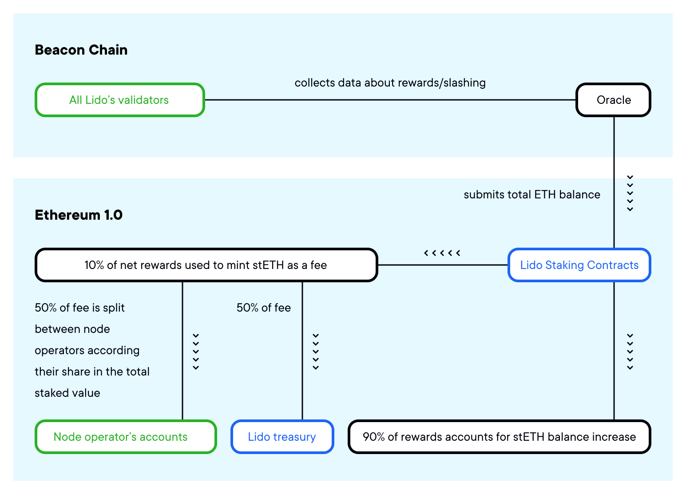
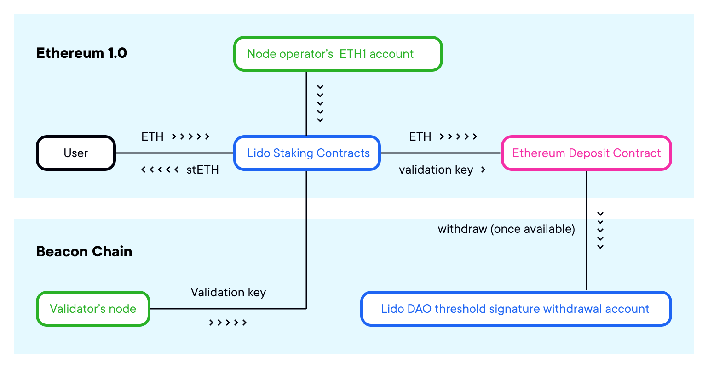
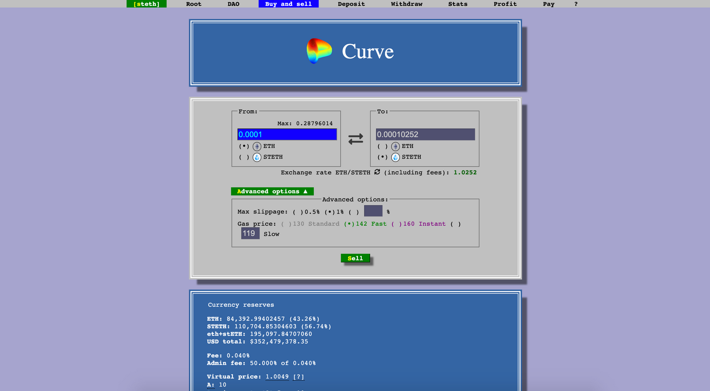
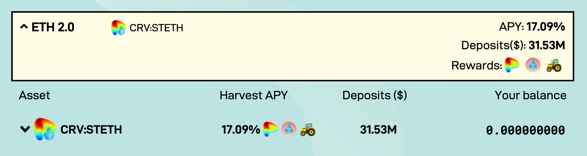

# stETH wstETH Integration Guide

Draft %in progress%

# stETH

### What stETH is

Normally users need to run own node and require at least 32ETH to participate in ETH 2.0. Funds will be locked until it is released. But with LIDO which allows users to stake their ETH into the ETH2.0 PoS network, anyone can stake  ETH and get back stETH + the x% staking reward from ETH2.0. The benefit of this is that stETH can be swapped for ETH at any time so users are no longer locked until ETH2.0 is released. 

The stETH token is a tokenized version of staked ether. When a user sends ether into the Lido liquid staking smart contract, the user receives the corresponding amount of stETH tokens. The stETH token represents Lido user’s deposits and the corresponding staking rewards and slashing penalties. It is also is a liquid alternative for the staked ether: it could be transferred, traded, or used in DeFi applications. The stETH token balance is be calculated based on the total amount of staked ether, plus rewards and minus any slashing penalties.

#




Lido makes the stETH token balance track a balance of corresponding balance of beacon chain ether. A user’s balance of stETH tokens corresponds 1 to 1 to an amount of ether a user could receive if withdrawals were enabled and instant.

The DAO selects node operators, which also validate transactions on the beacon chain and adds their addresses to the `NodeOperatorsRegistry` contract. Authorized node operators have to generate a set of keys for the validation and also provide them with the smart contract. As ether is received from users, it is distributed in chunks of 32 Ether between all active node operators. The staking pool contract contains a list of node operators, their keys, and the logic for distributing rewards between them.

#



StETH is a rebasable token. It receives reports from the Oracle contract `pushBeacon method` with the state of the protocol's ETH2 validators balances, and updates all the balances of stETH holders distributing the protocol's total staking rewards and penalties. The protocol employs distributed Oracle reporting: there are five Oracle daemons running by the Lido Node operators, and the Oracle smart contract formats beacon report on the consensus of three of five daemon reports. On top of the consensus mechanics, there are sanity checks for reports with sudden drops in total ETH2 balance or rewards with higher-than-possible APY. 

stETH is very good collateral for people who are long Ethereum, as it lets them at once margin long ETH and compounds it with staking rewards. Staking rewards alone can pay off stability fee if it's sufficiently low. The protocol applies a 10% fee (this can be changed by the DAO) on staking rewards that are split between node operators, the DAO, and a slashing insurance fund.

Node operators also validate transactions on the beacon chain. The DAO selects node operators and adds their addresses to the NodeOperatorsRegistry contract. Authorized node operators have to generate a set of keys for the validation and also provide them with the smart contract. As ether is received from users, it is distributed in chunks of 32 Ether between all active node operators. The staking pool contract contains a list of node operators, their keys, and the logic for distributing rewards between them.

**Note:** As stETH is a rebasable token and integration of this asset requires a custom `GemJoin` contract. An easier and less risky way is to integrate wstETH, a trustless fixed-balance wrapper ([https://docs.lido.fi/contracts/wsteth](https://docs.lido.fi/contracts/wsteth)), and use the standard `GemJoin` contract. StETH token is the upgradable contract behind `AppProxyUpgradeable` proxy at [Etherscan](https://etherscan.io/address/0xae7ab96520de3a18e5e111b5eaab095312d7fe84). 


## Tokenomics

Beacon chain's withdrawals are scheduled after merge which should happen around Q1-Q2 2022. Once these features are deployed, the Lido DAO will upgrade Lido to allow the users to burn stETH tokens in exchange for ether. 

[wstETH](https://docs.lido.fi/contracts/wsteth) is a constant-balance wrapper ERC20 token that converts stETH balances which undergo periodical rebases to the underlying shares balances. As Lido oracles report beacon chain rewards, penalties, or slashings, wstETH token balances remain unchanged: instead, the amount of stETH corresponding to one wstETH (and thus wstETH price) changes. Anyone can convert stETH to wstETH and vice versa on-chain through [wstETH.wrap](https://docs.lido.fi/contracts/wsteth#wrap) and [wstETH.unwrap](https://docs.lido.fi/contracts/wsteth#unwrap) functions.

Since wstETH and stETH represent the same underlying asset (Ether staked with Lido plus the rewards accrued) and can be mutually converted at any given time, one can consider the combination of wstETH and stETH liquidity on all exchanges as contributing to a common liquidity pool. stETH price can be converted to wstETH price by multiplying the former by a coefficient obtained from either stETH or wstETH contract.

## Mechanics of stETH

stETH token balances update once a day when the oracle reports changes in Eth2 deposits and changes in ETH rewards from users who stake via Lido. This occurs once a day at 12PM UTC. Because the rewards are embodied through a balance rebase, users who hold stETH will not see a transaction sent to their wallet. Rather, users should see their stETH balance automatically change without an accompanying transaction taking place.

This rebase works across integrated DeFi platforms like Curve and Yearn. This means that if you are to stake your stETH across these protocols to earn additional yields, you will continue to benefit from daily stETH staking rewards as well. UniSwap, 1inch and SushiSwap are not designed for rebasable tokens and as a result you risk losing out on a portion of your daily staking rewards through providing stETH as liquidity across these platforms.

When a user deposits ETH via Lido, that ETH is split between node operators which is then sent to their respective validators.

## The stETH Reward Rate

Users who stake their ETH with Lido will receive daily rewards - in the form of stETH balance rebases - from day one. This is possible because staking rewards with Lido are socialised across all stakers. Rebases affect all holders of stETH regardless of whether their ETH has actually been deposited into the queue as of yet.
This mechanism is the reason why the stETH reward rate is currently lower than that of Ethereum.

Only a portion of Lido validators have made it through the queue, from which all existing stETH holders are accruing their rewards – including the new depositors. This results in an initially lower reward rate because the amount of rewards being accrued from the minority of already accepted validators is being split proportionally towards all stETH holders.

As more of Lido’s validators are activated, the stETH reward rate will grow correspondingly and gravitate towards the full Ethereum staking rate.
To track the Eth validator queue, visit eth2-validator-queue.web.app.

A dashboard to view these validators (and their time in queue alongside their estimated finalizing date) is currently being developed. This dashboard will also display related information such as: number of current validators, rewards being paid out to stETH holders, total amount of ETH staked via Lido, the active number of stakers, Lido APY, Eth2 APY.

# Rebases & beacon chain Oracle

# Lido

- [Source code](https://github.com/lidofinance/lido-dao/blob/master/contracts/0.4.24/Lido.sol)
- [Deployed contract](https://etherscan.io/address/0xae7ab96520de3a18e5e111b5eaab095312d7fe84)

Lido is the core contract which acts as a liquid staking pool. The contract is responsible for Ether deposits and withdrawals, minting and burning liquid tokens, delegating funds to node operators, applying fees, and accepting updates from the oracle contract. Node Operators' logic is extracted to a separate contract, NodeOperatorsRegistry.

Lido also acts as an ERC20 token which represents staked ether, stETH. Tokens are minted upon deposit and burned when redeemed. stETH tokens are pegged 1:1 to the Ethers that are held by Lido. stETH token’s balances are updated when the oracle reports change in total stake every day.

## Rebasing

When a rebase occurs the supply of the token is increased or decreased algorithmically, based on the staking rewards(or slashing penalties) in the Eth2 chain. Rebase happens when oracles report beacon stats.

Rebasing mechanism implemented via "shares". Instead of storing map with account balances, Lido stores which share owned by account in the total amount of Ether controlled by the protocol.

Balance of account calculated next way:

```
balanceOf(account) = shares[account] * totalPooledEther / totalShares
```

- `shares` - map of user account shares. Every time user deposit ether, it converted to shares and added to current user shares.

- `totalShares` sum of shares of all account in `shares` map

- `totalPooledEther` is a sum of three types of ether owned by protocol:

  - buffered balance - ether stored on contract and haven't deposited to official Deposit contract yet.
  - transient balance - ether submitted to the official Deposit contract but not yet visible in the beacon state.
  - beacon balance - total amount of ether on validator accounts. This value reported by oracles and makes strongest impact to stETH total supply change.

For example, assume that we have:

```
totalShares = 500
totalPooledEther = 10 ETH
sharesOf(Alice) -> 100
sharesOf(Bob) -> 400
```

Therefore:

```
balanceOf(Alice) -> 2 tokens which corresponds 2 ETH
balanceOf(Bob) -> 8 tokens which corresponds 8 ETH
```

## Beacon Stats Reporting

One of the most important parts of protocol, it's precise and steady reported data about current balances of validators. Such reports happen once at defined period of time, called frame. Frame duration set by DAO, current value is 24 hours.

To update stats on main Lido contract oracle demands quorum to be reached.
Quorum - is a necessary amount of reports with equal stats from offchain oracle daemons run by protocol participants.
Quorum size and members controlled by DAO.
If quorum wasn't reached next report can happen only at the first epoch of next frame (after 24 hours).

Report consists of count of validators participated in protocol - beacon validators and total amount of ether on validator accounts - beacon balance. Typically beacon balance growth from report to report, but in exceptional cases it also can drops, because of slashing.

- When beacon balance grown between reports, protocol register profit and distribute reward of fresh minting stETH tokens between stETH holders, node operators, insurance fund and treasury. Fee distribution for node operators, insurance fund and treasury can be set by DAO.
- When frame was ended with slashing and new beacon balance less than previous one total supply of stETH becomes less than in previous report and no rewards distributed.

## View Methods

### name()

Returns the name of the token

```sol
function name() returns (string)
```

### symbol()

Returns the symbol of the token, usually a shorter version of the name

```sol
function symbol() returns (string)
```

### decimals()

Returns the number of decimals for getting user representation of a token amount.

```sol
function decimals() returns (uint8)
```

### totalSupply()

Returns the amount of tokens in existence.

```sol
function totalSupply() returns (uint256)
```


**Note:** Always equals to `getTotalPooledEther()` since token amount
is pegged to the total amount of Ether controlled by the protocol.


### getTotalPooledEther()

Returns the entire amount of Ether controlled by the protocol

```sol
function getTotalPooledEther() returns (uint256)
```


**Note:** The sum of all ETH balances in the protocol, equals to the total supply of stETH.


### balanceOf()

Returns the amount of tokens owned by the `_account`

```sol
function balanceOf(address _account) returns (uint256)
```


**Note:** Balances are dynamic and equal the `_account`'s share in the amount of the
total Ether controlled by the protocol. See `sharesOf`.


### getTotalShares()

Returns the total amount of shares in existence.

```sol
function getTotalShares() returns (uint256)
```

### sharesOf()

Returns the amount of shares owned by `_account`

```sol
function sharesOf(address _account) returns (uint256)
```

### getSharesByPooledEth()

Returns the amount of shares that corresponds to `_ethAmount` protocol-controlled Ether

```sol
function getSharesByPooledEth(uint256 _ethAmount) returns (uint256)
```

### getPooledEthByShares()

Returns the amount of Ether that corresponds to `_sharesAmount` token shares

```sol
function getPooledEthByShares(uint256 _sharesAmount) returns (uint256)
```

### getFee()

Returns staking rewards fee rate

```sol
function getFee() returns (uint16)
```

#### Returns:

Fee in basis points. 10000 BP corresponding to 100%.

### getFeeDistribution()

Returns fee distribution proportion

```sol
function getFeeDistribution() returns (
  uint16 treasuryFeeBasisPoints,
  uint16 insuranceFeeBasisPoints,
  uint16 operatorsFeeBasisPoints
)
```

#### Returns:

| Name                      | Type     | Description                                                                            |
| ------------------------- | -------- | -------------------------------------------------------------------------------------- |
| `treasuryFeeBasisPoints`  | `uint16` | Fee for the treasury. Expressed in basis points, 10000 BP corresponding to 100%.       |
| `insuranceFeeBasisPoints` | `uint16` | Fee for the insurance fund. Expressed in basis points, 10000 BP corresponding to 100%. |
| `operatorsFeeBasisPoints` | `uint16` | Fee for the node operators. Expressed in basis points, 10000 BP corresponding to 100%. |

### getWithdrawalCredentials()

Returns current credentials to withdraw ETH on ETH 2.0 side after the phase 2 is launched

```sol
function getWithdrawalCredentials() returns (bytes32)
```

### getBufferedEther()

Get the amount of Ether temporary buffered on this contract balance


**Note:** Buffered balance is kept on the contract from the moment the funds are received from user
until the moment they are actually sent to the official Deposit contract.


```sol
function getBufferedEther()  returns (uint256)
```

#### Returns:

Amount of buffered funds in wei

### getDepositContract()

Gets deposit contract handle

```sol
function getDepositContract() public view returns (IDepositContract)
```

#### Returns:

Address of deposit contract

### getOracle()

Returns authorized oracle address

```sol
function getOracle() returns (address)
```

### getOperators()

Gets node operators registry interface handle

```sol
function getOperators() returns (INodeOperatorsRegistry)
```

#### Returns:

Address of NodeOperatorsRegistry contract

### getTreasury()

Returns the treasury address

```sol
function getTreasury() returns (address)
```

### getInsuranceFund()

Returns the insurance fund address

```sol
function getInsuranceFund() returns (address)
```

### getBeaconStat()

Returns the key values related to Beacon-side

```sol
function getBeaconStat() returns (
  uint256 depositedValidators,
  uint256 beaconValidators,
  uint256 beaconBalance
)
```

#### Returns:

| Name                  | Type      | Description                                                                    |
| --------------------- | --------- | ------------------------------------------------------------------------------ |
| `depositedValidators` | `uint256` | Number of deposited validators                                                 |
| `beaconValidators`    | `uint256` | Number of Lido's validators visible in the Beacon state, reported by oracles   |
| `beaconBalance`       | `uint256` | Total amount of Beacon-side Ether (sum of all the balances of Lido validators) |

## Methods

### transfer()

Moves `_amount` tokens from the caller's account to the `_recipient` account.

```sol
function transfer(address _recipient, uint256 _amount) returns (bool)
```

**Note:**

Requirements:

- `_recipient` cannot be the zero address.
- the caller must have a balance of at least `_amount`.
- the contract must not be paused.


#### Parameters:

| Name         | Type      | Description                  |
| ------------ | --------- | ---------------------------- |
| `_recipient` | `address` | Address of tokens recipient  |
| `_amount`    | `uint256` | Amount of tokens to transfer |

#### Returns:

A boolean value indicating whether the operation succeeded.

### allowance()

Returns the remaining number of tokens that `_spender` is allowed to spend
on behalf of `_owner` through `transferFrom`. This is zero by default.

```sol
function allowance(address _owner, address _spender) returns (uint256)
```


This value changes when `approve` or `transferFrom` is called.


#### Parameters:

| Name       | Type      | Description        |
| ---------- | --------- | ------------------ |
| `_owner`   | `address` | Address of owner   |
| `_spender` | `address` | Address of spender |

### approve()

Sets `_amount` as the allowance of `_spender` over the caller's tokens

```sol
function approve(address _spender, uint256 _amount) returns (bool)
```

**Note:**

Requirements:

- `_spender` cannot be the zero address.
- the contract must not be paused.


#### Parameters:

| Name       | Type      | Description        |
| ---------- | --------- | ------------------ |
| `_spender` | `address` | Address of spender |
| `_amount`  | `uint256` | Amount of tokens   |

#### Returns:

A boolean value indicating whether the operation succeeded

### transferFrom()

Moves `_amount` tokens from `_sender` to `_recipient` using the
allowance mechanism. `_amount` is then deducted from the caller's
allowance.

```sol
function transferFrom(
  address _sender,
  address _recipient,
  uint256 _amount
) returns (bool)
```

**Note:**

Requirements:

- `_sender` and `_recipient` cannot be the zero addresses.
- `_sender` must have a balance of at least `_amount`.
- the caller must have allowance for `_sender`'s tokens of at least `_amount`.
- the contract must not be paused.


#### Parameters:

| Name         | Type      | Description          |
| ------------ | --------- | -------------------- |
| `_sender`    | `address` | Address of spender   |
| `_recipient` | `address` | Address of recipient |
| `_amount`    | `uint256` | Amount of tokens     |

#### Returns:

A boolean value indicating whether the operation succeeded

### increaseAllowance()

Atomically increases the allowance granted to `_spender` by the caller by `_addedValue`

This is an alternative to `approve` that can be used as a mitigation for problems described [here](https://github.com/OpenZeppelin/openzeppelin-contracts/blob/master/contracts/token/ERC20/IERC20.sol#L42)

```sol
function increaseAllowance(address _spender, uint256 _addedValue) returns (bool)
```


**Note:**

Requirements:

- `_spender` cannot be the the zero address.
- the contract must not be paused.


#### Parameters:

| Name          | Type      | Description                            |
| ------------- | --------- | -------------------------------------- |
| `_sender`     | `address` | Address of spender                     |
| `_addedValue` | `uint256` | Amount of tokens to increase allowance |

#### Returns:

Returns a boolean value indicating whether the operation succeeded

### decreaseAllowance()

Atomically decreases the allowance granted to `_spender` by the caller by `_subtractedValue`

This is an alternative to `approve` that can be used as a mitigation for
problems described [here](https://github.com/OpenZeppelin/openzeppelin-contracts/blob/master/contracts/token/ERC20/IERC20.sol#L42)

```sol
function decreaseAllowance(address _spender, uint256 _subtractedValue) returns (bool)
```

**Note:**

Requirements:

- `_spender` cannot be the zero address.
- `_spender` must have allowance for the caller of at least `_subtractedValue`.
- the contract must not be paused.


#### Parameters:

| Name               | Type      | Description                            |
| ------------------ | --------- | -------------------------------------- |
| `_sender`          | `address` | Address of spender                     |
| `_subtractedValue` | `uint256` | Amount of tokens to decrease allowance |

#### Returns:

Returns a boolean value indicating whether the operation succeeded

### submit()

Send funds to the pool with optional \_referral parameter

```sol
function submit(address _referral) returns (uint256)
```

#### Parameters:

| Name        | Type      | Description               |
| ----------- | --------- | ------------------------- |
| `_referral` | `address` | Optional referral address |

#### Returns:

Amount of StETH shares generated

### depositBufferedEther()

Deposits buffered ethers to the official DepositContract. If `_maxDeposits` provided makes no more than `_maxDeposits` deposit calls

```sol
function depositBufferedEther()
function depositBufferedEther(uint256 _maxDeposits)
```

#### Parameters:

| Name           | Type      | Description                 |
| -------------- | --------- | --------------------------- |
| `_maxDeposits` | `uint256` | Number of max deposit calls |

### burnShares()

Destroys `_sharesAmount` shares from `_account`'s holdings, decreasing the total amount of shares.

```sol
function burnShares(
  address _account,
  uint256 _sharesAmount
) returns (uint256 newTotalShares)
```


**Note:** This doesn't decrease the token total supply.

Requirements:

- `_account` cannot be the zero address.
- `_account` must hold at least `_sharesAmount` shares.
- the contract must not be paused.


#### Parameters

| Name            | Type      | Description                         |
| --------------- | --------- | ----------------------------------- |
| `_account`      | `address` | Address where shares will be burned |
| `_sharesAmount` | `uint256` | Amount of shares to burn            |

#### Returns

Amount of totalShares after tokens burning

### stop()

Stop pool routine operations

```sol
function stop()
```

### resume()

Resume pool routine operations

```sol
function resume()
```

### setFee()

Set fee rate to `_feeBasisPoints` basis points. The fees are accrued when oracles report staking results

```sol
function setFee(uint16 _feeBasisPoints)
```

#### Parameters

| Name              | Type     | Description                                                    |
| ----------------- | -------- | -------------------------------------------------------------- |
| `_feeBasisPoints` | `uint16` | Fee expressed in basis points, 10000 BP corresponding to 100%. |

### setFeeDistribution()

Set fee distribution: `_treasuryFeeBasisPoints` basis points go to the treasury,
`_insuranceFeeBasisPoints` basis points go to the insurance fund,
`_operatorsFeeBasisPoints` basis points go to node operators.
The sum has to be 10 000.

```sol
function setFeeDistribution(
  uint16 _treasuryFeeBasisPoints,
  uint16 _insuranceFeeBasisPoints,
  uint16 _operatorsFeeBasisPoints
)
```

#### Parameters

| Name                       | Type     | Description                                                                            |
| -------------------------- | -------- | -------------------------------------------------------------------------------------- |
| `_treasuryFeeBasisPoints`  | `uint16` | Fee for the treasury. Expressed in basis points, 10000 BP corresponding to 100%.       |
| `_insuranceFeeBasisPoints` | `uint16` | Fee for the insurance fund. Expressed in basis points, 10000 BP corresponding to 100%. |
| `_operatorsFeeBasisPoints` | `uint16` | Fee for the node operators. Expressed in basis points, 10000 BP corresponding to 100%. |

### setOracle()

Set authorized oracle contract address to `_oracle`

```sol
function setOracle(address _oracle)
```

#### Parameters

| Name      | Type      | Description                |
| --------- | --------- | -------------------------- |
| `_oracle` | `address` | Address of oracle contract |

### setTreasury()

Set treasury contract address to `_treasury`. This contract is used to accumulate the protocol treasury fee

```sol
function setTreasury(address _treasury)
```

#### Parameters

| Name        | Type      | Description                                        |
| ----------- | --------- | -------------------------------------------------- |
| `_treasury` | `address` | Address of contract which accumulates treasury fee |

### setInsuranceFund()

Set insuranceFund contract address to `_insuranceFund`.
This contract is used to accumulate the protocol insurance fee

```sol
function setInsuranceFund(address _insuranceFund)
```

#### Parameters

| Name             | Type      | Description                                         |
| ---------------- | --------- | --------------------------------------------------- |
| `_insuranceFund` | `address` | Address of contract which accumulates insurance fee |

### setWithdrawalCredentials()

Set credentials to withdraw ETH on ETH 2.0 side after the phase 2 is launched to `_withdrawalCredentials`

```sol
function setWithdrawalCredentials(bytes32 _withdrawalCredentials)
```


**Note:** Note that `setWithdrawalCredentials` discards all unused signing keys as the signatures are invalidated.


#### Parameters

| Name                     | Type      | Description                                                                                 |
| ------------------------ | --------- | ------------------------------------------------------------------------------------------- |
| `_withdrawalCredentials` | `bytes32` | Hash of withdrawal multisignature key as accepted by the deposit_contract.deposit functione |

### withdraw()

Issues withdrawal request. **Not implemented.**

```sol
function withdraw(uint256 _amount, bytes32 _pubkeyHash)
```


**Note:** Will be upgraded to an actual implementation when withdrawals are enabled (Phase 1.5 or 2 of Eth2 launch, likely late 2021 or 2022). At the moment withdrawals are not possible in the beacon chain and there's no workaround


#### Parameters

| Name          | Type      | Description                 |
| ------------- | --------- | --------------------------- |
| `_amount`     | `uint256` | Amount of StETH to withdraw |
| `_pubkeyHash` | `bytes32` | Receiving address           |

### pushBeacon()

Updates the number of Lido-controlled keys in the beacon validators set and their total balance.

```sol
function pushBeacon(uint256 _beaconValidators, uint256 _beaconBalance)
```

#### Parameters

| Name                | Type      | Description                                       |
| ------------------- | --------- | ------------------------------------------------- |
| `_beaconValidators` | `uint256` | Number of Lido's keys in the beacon state         |
| `_beaconBalance`    | `uint256` | Summarized balance of Lido-controlled keys in wei |

### transferToVault()

Send funds to recovery Vault. Overrides default AragonApp behaviour.

```sol
function transferToVault(address _token)
```

#### Parameters

| Name     | Type      | Description                        |
| -------- | --------- | ---------------------------------- |
| `_token` | `address` | Token to be sent to recovery vault |


# LidoOracle

- [Source code](https://github.com/lidofinance/lido-dao/blob/master/contracts/0.4.24/oracle/LidoOracle.sol)
- [Deployed contract](https://etherscan.io/address/0x442af784A788A5bd6F42A01Ebe9F287a871243fb)

LidoOracle is a contract where oracles send addresses' balances controlled by the DAO on the ETH
2.0 side. The balances can go up because of reward accumulation and can go down due to slashing and
staking penalties. Oracles are assigned by the DAO.

Oracle daemons push their reports every frame (225 epochs currently, equal to one day) and when the
number of the same reports reaches the ['quorum'](#getquorum) value, the report is pushed to the
[Lido contract][6].

The following mechanisms are also worth mentioning.

## Store the collected reports as an array

The report variant is a report with a counter - how many times this report was pushed by
oracles. This strongly simplified logic of `_getQuorumReport`, because in the majority of cases, we
only have 1 variant of the report so we just make sure that its counter exceeded the quorum value.


**Note:** The important note here is that when we remove an oracle (with `removeOracleMember`), we
also need to remove her report from the currently accepted reports. As of now, we do not keep a
mapping between members and their reports, we just clean all existing reports and wait for the
remaining oracles to push the same epoch again.


## Add calculation of staker rewards [APR][1]

To calculate the percentage of rewards for stakers, we store and provide the following data:

- `preTotalPooledEther` - total pooled ether mount, queried right before every report push to the
  [Lido contract][6],
- `postTotalPooledEther` - the same, but queried right after the push,
- `lastCompletedEpochId` - the last epoch that we pushed the report to the Lido,
- `timeElapsed` - the time in seconds between the current epoch of push and the
  `lastCompletedEpochId`. Usually, it should be a frame long: 32 _ 12 _ 225 = 86400, but maybe
  multiples more in case that the previous frame didn't reach the quorum.


**Note:** It is important to note here, that we collect post/pre pair (not current/last), to avoid
the influence of new staking during the epoch.

To calculate the APR, use the following formula:

    APR = (postTotalPooledEther - preTotalPooledEther) * secondsInYear / (preTotalPooledEther * timeElapsed)

## Sanity checks the oracles reports by configurable values

In order to limit the misbehaving oracles impact, we want to limit oracles report change by 10% APR
increase in stake and 5% decrease in stake. Both values are configurable by the governance in case
of extremely unusual circumstances.


**Note:** Note that the change is evaluated after the quorum of oracles reports is reached, and not
on the individual report.


And the logic of reporting to the [Lido contract][6] got a call to `_reportSanityChecks` that does
the following. It compares the `preTotalPooledEther` and `postTotalPooledEther` (see above) and

- if there is a profit or same, calculates the [APR][1], compares it with the upper bound. If was
  above, reverts the transaction with `ALLOWED_BEACON_BALANCE_INCREASE` code.
- if there is a loss, calculates relative decrease and compares it with the lower bound. If was
  below, reverts the transaction with `ALLOWED_BEACON_BALANCE_DECREASE` code.

## Receiver function to be invoked on report pushes

To provide the external contract with updates on report pushes (every time the quorum is reached
among oracle daemons data), we provide the following setter and getter functions. It might be
needed to implement some updates to the external contracts that should happen at the same tx the
[rebase](/contracts/lido#rebasing) happens (e.g. adjusting uniswap v2 pools to reflect the
rebase).

And when the callback is set, the following function will be invoked on every report push.

    interface IBeaconReportReceiver {
        function processLidoOracleReport(uint256 _postTotalPooledEther,
                                         uint256 _preTotalPooledEther,
                                         uint256 _timeElapsed) external;
    }

The arguments provided are the same as described in section [above][3].

## View Methods

### getLido()

Return the [Lido contract][6] address.

```sol
function getLido() returns (ILido)
```

### getQuorum()

Return the number of exactly the same reports needed to finalize the epoch.

```sol
function getQuorum() returns (uint256)
```

### getAllowedBeaconBalanceAnnualRelativeIncrease()

Return the upper bound of the reported balance possible increase in [APR][1]. See above about
[sanity checks][4].

```sol
function getAllowedBeaconBalanceAnnualRelativeIncrease() returns (uint256)
```

### getAllowedBeaconBalanceRelativeDecrease()

Return the lower bound of the reported balance possible decrease. See above about [sanity
checks][4].

```sol
function getAllowedBeaconBalanceRelativeDecrease() returns (uint256)
```

### getBeaconReportReceiver()

Return the receiver contract address to be called when the report is pushed to [Lido][6].

```sol
function getBeaconReportReceiver() returns (address)
```

### getCurrentOraclesReportStatus()

Return the current reporting bitmap, representing oracles who have already pushed their version of
report during the expected epoch.

**Note: Every oracle bit corresponds to the index of the oracle in the current members list

```sol
function getCurrentOraclesReportStatus() returns (uint256)
```

### getCurrentReportVariantsSize()

Return the current reporting variants array size.

```sol
function getCurrentReportVariantsSize() returns (uint256)
```

### getCurrentReportVariant()

Return the current reporting array element with index `_index`.

```sol
function getCurrentReportVariant(uint256 _index)
```

### getExpectedEpochId()

Return epoch that can be reported by oracles.

```sol
function getExpectedEpochId() returns (uint256)
```

### getOracleMembers()

Return the current oracle member committee list.

```sol
function getOracleMembers() returns (address[])
```

### getVersion()

Return the initialized version of this contract starting from 0.

```sol
function getVersion() returns (uint256)
```

### getBeaconSpec()

Return beacon specification data.

```sol
function getBeaconSpec()
    returns (
        uint64 epochsPerFrame,
        uint64 slotsPerEpoch,
        uint64 secondsPerSlot,
        uint64 genesisTime
    )
```

### getCurrentEpochId()

Return the epoch calculated from current timestamp.

```sol
function getCurrentEpochId() returns (uint256)
```

### getCurrentFrame()

Return currently reportable epoch (the first epoch of the current frame) as well as its start and
end times in seconds.

```sol
function getCurrentFrame()
    returns (
        uint256 frameEpochId,
        uint256 frameStartTime,
        uint256 frameEndTime
    )
```

### getLastCompletedEpochId()

Return last completed epoch.

```sol
function getLastCompletedEpochId() returns (uint256)
```

### getLastCompletedReportDelta()

Report beacon balance and its change during the last frame.

```sol
function getLastCompletedReportDelta()
    returns (
        uint256 postTotalPooledEther,
        uint256 preTotalPooledEther,
        uint256 timeElapsed
    )
```

## Methods

### setAllowedBeaconBalanceAnnualRelativeIncrease()

Set the upper bound of the reported balance possible increase in APR to `_value`. See above about
[sanity checks][4].

```sol
function setAllowedBeaconBalanceAnnualRelativeIncrease(uint256 _value) auth(SET_REPORT_BOUNDARIES)
```

### setAllowedBeaconBalanceRelativeDecrease()

Set the lower bound of the reported balance possible decrease to `_value`. See above about [sanity
checks][4].

```sol
function setAllowedBeaconBalanceRelativeDecrease(uint256 _value) auth(SET_REPORT_BOUNDARIES)
```

### setBeaconReportReceiver()

Set the receiver contract address to `_addr` to be called when the report is pushed.

:::note
Specify 0 to disable this functionality.
:::

```sol
function setBeaconReportReceiver(address _addr) auth(SET_BEACON_REPORT_RECEIVER)
```

### setBeaconSpec()

Update beacon specification data.

```sol
function setBeaconSpec(
    uint64 _epochsPerFrame,
    uint64 _slotsPerEpoch,
    uint64 _secondsPerSlot,
    uint64 _genesisTime
    )
    auth(SET_BEACON_SPEC)
```

### initialize_v2()

Initialize the contract v2 data, with sanity check bounds
(`_allowedBeaconBalanceAnnualRelativeIncrease`, `_allowedBeaconBalanceRelativeDecrease`).


**Note:** Public function `initialize` was removed from v2 because it is not needed once the contract is
initialized for the first time, that happened in v1. Instead we added `initialize_v2` function that
initializes newly added variables, updates the contract version to 1.


```sol
function initialize_v2(
    uint256 _allowedBeaconBalanceAnnualRelativeIncrease,
    uint256 _allowedBeaconBalanceRelativeDecrease
)
```

### addOracleMember()

Add `_member` to the oracle member committee list.

```sol
function addOracleMember(address _member) auth(MANAGE_MEMBERS)
```

### removeOracleMember()

Remove '\_member` from the oracle member committee list.

```sol
function removeOracleMember(address _member) auth(MANAGE_MEMBERS)
```

### setQuorum()

Set the number of exactly the same reports needed to finalize the epoch to `_quorum`.

```sol
function setQuorum(uint256 _quorum) auth(MANAGE_QUORUM)
```

### reportBeacon()

Accept oracle committee member reports from the ETH 2.0 side. Parameters:

- `_epochId` - beacon chain epoch
- `_beaconBalance` - balance in gwei on the ETH 2.0 side (9-digit denomination)
- `_beaconValidators` - number of validators visible in this epoch

```sol
function reportBeacon(uint256 _epochId, uint64 _beaconBalance, uint32 _beaconValidators)
```
# StableSwapStateOracle

- [Source Code](https://github.com/lidofinance/curve-merkle-oracle/blob/main/contracts/StableSwapStateOracle.sol)
- [Deployed Contract](https://etherscan.io/address/0x3a6bd15abf19581e411621d669b6a2bbe741ffd6)

A trustless oracle for the ETH/stETH Curve pool using Merkle Patricia proofs of Ethereum state.

Contract receives and verifies the report from the offchain code,
and persists the verified state along with its timestamp.

The oracle assumes that the pool's `fee` and `A` (amplification coefficient) values don't
change between the time of proof generation and submission.

## Mechanics

The oracle works by verifying Merkle Patricia proofs of the following Ethereum state:

- Curve stETH/ETH pool contract account and the following slots from its storage trie:

  - `admin_balances[0]`
  - `admin_balances[1]`

- stETH contract account and the following slots from its storage trie:
  - `shares[0xDC24316b9AE028F1497c275EB9192a3Ea0f67022]`
  - `keccak256("lido.StETH.totalShares")`
  - `keccak256("lido.Lido.beaconBalance")`
  - `keccak256("lido.Lido.bufferedEther")`
  - `keccak256("lido.Lido.depositedValidators")`
  - `keccak256("lido.Lido.beaconValidators")`

## View Methods

### getState()

```sol
function getState() external view returns (
  uint256 _timestamp,
  uint256 _etherBalance,
  uint256 _stethBalance,
  uint256 _stethPrice
)
```

Returns current state of oracle

| Return Parameter | Type      | Description                                  |
| ---------------- | --------- | -------------------------------------------- |
| `_timestamp`     | `uint256` | The timestamp of the proven pool state/price |
| `_etherBalance`  | `uint256` | The proven ETH balance of the pool           |
| `_stethBalance`  | `uint256` | The proven stETH balance of the pool         |
| `_stethPrice`    | `uint256` | The proven stETH/ETH price in the pool       |

### getProofParams()

```sol
function getProofParams() external view returns (
  address poolAddress,
  address stethAddress,
  bytes32 poolAdminEtherBalancePos,
  bytes32 poolAdminCoinBalancePos,
  bytes32 stethPoolSharesPos,
  bytes32 stethTotalSharesPos,
  bytes32 stethBeaconBalancePos,
  bytes32 stethBufferedEtherPos,
  bytes32 stethDepositedValidatorsPos,
  bytes32 stethBeaconValidatorsPos,
  uint256 advisedPriceUpdateThreshold
)
```

Returns values of proof params

## Methods

### setAdmin()

```sol
function setAdmin(address _admin) external
```

Passes the right to set the suggested price update threshold to a new address.

| Parameter Name | type      | Description       |
| -------------- | --------- | ----------------- |
| `_admin`       | `address` | New admin address |

### setPriceUpdateThreshold()

```sol
function setPriceUpdateThreshold(uint256 _priceUpdateThreshold) external
```

Sets the suggested price update threshold.

| Parameter Name          | type      | Description                                                                                      |
| ----------------------- | --------- | ------------------------------------------------------------------------------------------------ |
| `_priceUpdateThreshold` | `uint256` | The suggested price update threshold. Expressed in basis points, 10000 BP corresponding to 100%. |

### submitState()

```sol
function submitState(
  bytes memory _blockHeaderRlpBytes,
  bytes memory _proofRlpBytes
) external
```

Used by the offchain clients to submit the proof


**Note:** Reverts unless:

- the block the submitted data corresponds to is in the chain;
- the block is at least `MIN_BLOCK_DELAY` blocks old
- all submitted proofs are valid


| Parameter Name         | type    | Description                                 |
| ---------------------- | ------- | ------------------------------------------- |
| `_blockHeaderRlpBytes` | `bytes` | RLP-encoded block header                    |
| `_proofRlpBytes`       | `bytes` | RLP-encoded list of Merkle Patricia proofs. |

`_proofRlpBytes` contains next encoded variables in exact order:

1. proof of the Curve pool contract account;
2. proof of the stETH contract account;
3. proof of the `admin_balances[0]` slot of the Curve pool contract;
4. proof of the `admin_balances[1]` slot of the Curve pool contract;
5. proof of the `shares[0xDC24316b9AE028F1497c275EB9192a3Ea0f67022]` slot of stETH contract;
6. proof of the `keccak256("lido.StETH.totalShares")` slot of stETH contract;
7. proof of the `keccak256("lido.Lido.beaconBalance")` slot of stETH contract;
8. proof of the `keccak256("lido.Lido.bufferedEther")` slot of stETH contract;
9. proof of the `keccak256("lido.Lido.depositedValidators")` slot of stETH contract;
10. proof of the `keccak256("lido.Lido.beaconValidators")` slot of stETH contract.

# StEthPriceFeed

- [Source Code](https://github.com/lidofinance/steth-price-feed/blob/main/contracts/StEthPriceFeed.vy)
- [Deployed Contract](https://etherscan.io/address/0xab55bf4dfbf469ebfe082b7872557d1f87692fe6)

Lido intends to provide secure and reliable price feed for stETH for protocols that intend to integrate it. Unfortunately, Chainlik is not available for stETH and Uniswap TWAP is not feasible at the moment: we'd want deep liquidity on stETH/ETH pair for this price, but Uni v2 doesn't allow tight curves for similaraly-priced coins.

stETH has deep liquidity in the Curve pool but it doesn't have a TWAP capability, so that's out, too. In the moment Curve price is flashloanable, if not easily. We decided that in a pinch we can provide a "price anchor" that would attest that "stETH/ETH price on Curve used to be around in recent past" (implemented using the [StableSwapStateOracle](./stable-swap-state-oracle)) and a price feed that could provide a reasonably safe estimation of current stETH/ETH price.

## Vocabulary

- **Current price**—current price of stETH on Curve pool. Flashloanable.
- **Historical price**—the price of stETH on Curve pool that was at least 15 blocks ago. May be older than 15 blocks: in that case, the pool price that was 15 blocks ago differs from the "historical price" by no more than `N`%.
- **Safe price range**—the range from `historical price - N%` to `min(historical price + N%, 1)`.
- **Safe price**—the price that's within the safe price range.

The parameter `N` is configured by the price feed admin; we're planning to initially set it to `5%`.

## stETH price feed specification

The feed is used to fetch stETH/ETH pair price in a safe manner. By "safe" we mean that the price should be expensive to significantly manipulate in any direction, e.g. using flash loans or sandwich attacks.

The feed interfaces with two contracts:

1. Curve stETH/ETH pool: [source](https://github.com/curvefi/curve-contract/blob/c6df0cf/contracts/pools/steth/StableSwapSTETH.vy), [deployed contract](https://etherscan.io/address/0xdc24316b9ae028f1497c275eb9192a3ea0f67022).
2. [StableSwapStateOracle](./stable-swap-state-oracle)

The pool is used as the main price source, and the oracle provides time-shifted price from the same pool used to establish a safe price range.

The price is defined as the amount of ETH wei needed to buy 1 stETH. For example, a price equal to `10**18` would mean that stETH is pegged 1:1 to ETH.

The safe price is defined as the one that satisfies all of the following conditions:

- The absolute value of percentage difference between the safe price and the time-shifted price fetched from the Merkle oracle is at most `max_safe_price_difference`.
- The safe price is at most `10**18`, meaning that stETH cannot be more expensive than ETH.

## Fail conditions

Price feed can give incorrect data in, as far as we can tell, three situations:

- stETH/ETH price moving suddenly and very quickly. There is at least 15 blocks delay between price drop and offchain oracle feed providers submitting a new historical price, and likely more bc tx are not mined instanteously. That should not happen normally: while stETH/ETH is volatile, it's not 5%-in-four-minutes volatile.
- oracle feed going stale because feed providers go offline. This is mitigated by the fact it's operated by several very experienced professionals (all of which, e.g., are Chainlink operators too) - and we only need one operational provider to maintain the feed. The only realistic scenario where this feed goes offline is deprecating the oracle alltogether.
- Multi-block flashloan attack. An block producer who is able to reliably get 2 blocks in a row can treat two blocks as an atomic transaction, leading to what is essentially a multiblock flashloan attack to manipulate price. That can lead to a short period of time (a few blocks) where stETH/ETH price feed is artificially manipulated. This attack is not mitigated, but in our opinion, not very realistic. It's very hard to pull off.

## View Methods

### safe_price()

Returns the cached safe price and its timestamp.

```
safe_price() -> (price: uint256, timestamp: uint256)
```

### current_price()

Returns the current pool price and whether the price is safe.

```
current_price() -> (price: uint256, is_safe: bool)
```

## Methods

### update_safe_price()

Sets the cached safe price to the `max(current pool price, 1)` given that the latter is safe.

```
update_safe_price() -> uint256
```

### fetch_safe_price()

Returns the cached safe price and its timestamp. Calls `update_safe_price()` prior to that if
the cached safe price is older than `max_age` seconds.

```
fetch_safe_price(max_age: uint256) -> (price: uint256, timestamp: uint256)
```

#### Parameters:

| Name      | Type      | Description                                                       |
| --------- | --------- | ----------------------------------------------------------------- |
| `max_age` | `uint256` | Amount of seconds last value of safe price considered to be valid |

# Oracle contract upgrade to v2

The following changes are to be made to the first mainnet version of the oracle contract.


## Change the meaning of 'quorum'.

In the first version, the quorum value denoted the minimum number of oracles needed to successfully
report results.

The proposed change is that the governance-controlled 'quorum' value means the minimum number of
exactly the same reports needed to *finalize* this epoch, which means that the final report is
pushed to Lido, no more reports are accepted for this epoch and the new expected epoch is advanced
to the next frame.

The reason for that change is that all non-byzantine oracles need to report exactly the same values
and if there are conflicting reports in the frame, it means some oracles are faulty or
malicious. With an old system it took a majority of quorum of faulty oracles to push their values
(e.g. 2 out of 3), with new system it takes a full quorum of them (3 out of 3).

For example, if the quorum value is `5` and suppose the oracles report consequently: `100`, `100`,
`101`, `0`, `100`, `100`, `100`: after the last, the report `100` wins because it was pushed 5
times. So it is pushed to Lido, epoch is finalized and no more reports for this epoch are accepted.


## Allow the number of oracle members to be less than the quorum value.

Current oracle removal lever (`removeOracleMember`) doesn't allow to remove oracle members if it
puts a number of members below quorum.

The most likely reason for removing an oracle member is a malicious oracle. It's better to have an
oracle with no quorum (as members are added or quorum value lowered by the voting process) than an
oracle with a quorum but a malicious member in it.

We implemented this by updating the restrictions (were `members.length >= _quorum`). Now the only
way to update the quorum value is with its mutator (untouched since v1):

    function setQuorum(uint256 _quorum) external auth(MANAGE_QUORUM)


## Use only the first epoch of the current frame for oracles reporting.

In the first version of the contract, we used "min/max reportable epoch" pair to determine the range
of epochs that the contract currently accepts. This led to the overly complicated logic. In
particular, we were keeping all report pushes for epochs of the current frame until one of them
reaches quorum. And in case of oracle members updates or quorum value changes, we just invalidated
all epochs except the last one (to avoid iterating over all epochs within the frame).

So now we found it reasonable to use only one epoch for oracle reportings, the first epoch of the
current frame. When an oracle reports a more recent epoch, we erase the current reporting data (even
if it did not reach a quorum) and advance to the new epoch.

**Warning**: Allowing only one epoch per frame (`_epochId % epochsPerFrame == 0`) is done to prevent a
malicious oracle from spoiling the quorum by continuously reporting a new epoch.

This change does not impact fair weather operations at all; the only setting where it is inferior to
the original procedure is a very specific kind of theoretical long-term eth2 turbulence where eth2
finality makes progress but lags behind last slot and that lag is 24h+ for a long time. It's been
never observed in the testnets and experts on eth2 consensus say it's a very convoluted scenario. So
we decided to axe it, and if it happens in the wild (which it won't), we can upgrade oracle back to
handle it better.


## Store the collected reports as an array.

In the first version of the contract, we stored the collected reports as a map between oracle member
and her report (`gatheredEpochData`). In this version, we found it reasonable to simplify and store
the reports as a raw array (`currentReportVariants`).

The report variant is a report with a counter - how many times this report was pushed by
oracles. This strongly simplified logic of `_getQuorumReport`, because in the majority of cases, we
only have 1 variant of the report so we just make sure that its counter exceeded the quorum value.

So `Algorithm` library, which used to find the majority element for the reporting, was completely
removed. Also `BitOps` library reduced to only checking whether the oracle member has already
reported or not, and thus was removed as a separate library.

:warning: The important note here is that when we remove an oracle (with `removeOracleMember`), we
also need to remove her report from the currently accepted reports. As of now, we do not keep a
mapping between members and their reports, we just clean all existing reports and wait for the
remaining oracles to push the same epoch again.

The following contract storage variables are used to keep the information.

    bytes32 internal constant EXPECTED_EPOCH_ID_POSITION =
        keccak256("lido.LidoOracle.expectedEpochId");
    bytes32 internal constant REPORTS_BITMASK_POSITION =
        keccak256("lido.LidoOracle.reoirtsBitMask");
    uint256[] private currentReportVariants;  // in place of gatheredEpochData mapping

:warning: Note that we're removing the report mapping `gatheredEpochData` and putting
`currentReportVariants` right in its place (slot) in the contract storage.

The following accessors are added to access this data:

    function getExpectedEpochId() external view returns (uint256);

    function getCurrentOraclesReportStatus() external view returns (uint256);

    function getCurrentReportVariantsSize() external view returns (uint256);

    function getCurrentReportVariant(uint256 _index)
        external
        view
        returns (
            uint64 beaconBalance,
            uint32 beaconValidators,
            uint16 count
        );


## Add calculation of staker rewards [APR][1].

To calculate the percentage of rewards for stakers, we store and provide the following data:

* `preTotalPooledEther` - total pooled ether mount, queried right before every report push to the
  Lido contract,
* `postTotalPooledEther` - the same, but queried right after the push,
* `lastCompletedEpochId` - the last epoch that we pushed the report to the Lido,
* `timeElapsed` - the time in seconds between the current epoch of push and the
  `lastCompletedEpochId`. Usually, it should be a frame long: 32 * 12 * 225 = 86400, but maybe
  multiples more in case that the previous frame didn't reach the quorum.

:warning: It is important to note here, that we collect post/pre pair (not current/last), to avoid
the influence of new staking during the epoch.

The following contract storage variables are used to keep the information.

    bytes32 internal constant POST_COMPLETED_TOTAL_POOLED_ETHER_POSITION =
        keccak256("lido.LidoOracle.postCompletedTotalPooledEther");
    bytes32 internal constant PRE_COMPLETED_TOTAL_POOLED_ETHER_POSITION =
        keccak256("lido.LidoOracle.preCompletedTotalPooledEther");
    bytes32 internal constant LAST_COMPLETED_EPOCH_ID_POSITION =
        keccak256("lido.LidoOracle.lastCompletedEpochId");
    bytes32 internal constant TIME_ELAPSED_POSITION =
        keccak256("lido.LidoOracle.timeElapsed");

The following accessors are added to access this data:

    function getLastCompletedEpochId() external view returns (uint256)

And this combined accessor helps to provide data for calculating the rewards of [stETH][2] holders.

    function getLastCompletedReportDelta()
        external
        view
        returns (
            uint256 postTotalPooledEther,
            uint256 preTotalPooledEther,
            uint256 timeElapsed
        )

To calculate the APR, use the following formula:

    APR = (postTotalPooledEther - preTotalPooledEther) * secondsInYear / (preTotalPooledEther * timeElapsed)

:warning: Note that there is a [fee](https://docs.lido.fi/contracts/lido#getfee) taken by the
protocol. The fee may change by the governance and should be subtracted from the reward amount
calculated above to represent the APR of the end-user.


## Sanity checks the oracles reports by configurable values.

In order to limit the misbehaving oracles impact, we want to limit oracles report change by 10% APR
increase in stake and 5% decrease in stake. Both values are configurable by the governance in case of
extremely unusual circumstances.

:warning: Note that the change is evaluated after the quorum of oracles reports is reached, and not
on the individual report.

For this, we have added the following accessors and mutators:

    function getAllowedBeaconBalanceAnnualRelativeIncrease() public view returns(uint256)

    function getAllowedBeaconBalanceRelativeDecrease() public view returns(uint256)

    function setAllowedBeaconBalanceAnnualRelativeIncrease(uint256 _value)
        external
        auth(SET_REPORT_BOUNDARIES)

    function setAllowedBeaconBalanceRelativeDecrease(uint256 _value)
        external
        auth(SET_REPORT_BOUNDARIES)

And the logic of reporting to the Lido contract got a call to `_reportSanityChecks` that does the
following. It compares the `preTotalPooledEther` and `postTotalPooledEther` (see above) and

**Note:**

* if there is a profit or same, calculates the [APR][1], compares it with the upper bound. If was above,
  reverts the transaction with `ALLOWED_BEACON_BALANCE_INCREASE` code.
* if there is a loss, calculates relative decrease and compares it with the lower bound. If was
  below, reverts the transaction with `ALLOWED_BEACON_BALANCE_DECREASE` code.


## Receiver function to be invoked on report pushes.

To provide the external contract with updates on report pushes (every time the quorum is reached
among oracle daemons data), we provide the following setter and getter functions. It might be needed
to implement some updates to the external contracts that should happen at the same tx the rebase
happens (e.g. adjusting uniswap v2 pools to reflect the rebase).

    function setBeaconReportReceiver(address _addr) external auth(SET_QUORUM_CALLBACK)

    function getBeaconReportReceiver() external view returns(address)

And when the callback is set, the following function will be invoked on every report push.

    interface IBeaconReportReceiver {
        function processLidoOracleReport(uint256 _postTotalPooledEther,
                                         uint256 _preTotalPooledEther,
                                         uint256 _timeElapsed) external;
    }

The arguments provided are the same as described in sections above.

The following contract storage variables are used to keep the information.

    bytes32 internal constant BEACON_REPORT_RECEIVER_POSITION =
        keccak256("lido.LidoOracle.beaconReportReceiver")


## Add events to cover all states change

The goal was to cover every state change and have access to every storage variable. This is why we
added the following events.

    event BeaconSpecSet(
        uint64 epochsPerFrame,
        uint64 slotsPerEpoch,
        uint64 secondsPerSlot,
        uint64 genesisTime
    );

Reports beacon specification update by governance.

    event ExpectedEpochIdUpdated(uint256 epochId)

Reports the new epoch that the contract is ready to accept from oracles. This happens as a result of
either a successful epoch finalization or when some oracle reported later epoch.

    event BeaconReported(
        uint256 epochId,
        uint128 beaconBalance,
        uint128 beaconValidators,
        address caller
    )

Reports the data that the oracle pushed to the contract with `reportBeacon` call.

    event PostTotalShares(
         uint256 postTotalPooledEther,
         uint256 preTotalPooledEther,
         uint256 timeElapsed,
         uint256 totalShares)

Reports statistics data when the quorum happened and the resulting report was pushed to Lido. Here,
`totalShares` is grabbed from the Lido contract, see [Add calculation of staker rewards APR][3]
section above for other arguments.

    event AllowedBeaconBalanceAnnualRelativeIncreaseSet(uint256 value)
    event AllowedBeaconBalanceRelativeDecreaseSet(uint256 value)

Reports the updates of the threshold limits by the governance.
See [Sanity checks the oracles reports by configurable values][4] section above for details.

    event BeaconReportReceiverSet(address callback);

Reports the updates of the beacon report receiver, [Receiver function to be invoked on report pushes][5].

    event ContractVersionSet(uint256 version);

Reports the initialization of the new version of the contract. This second version will be 1.

It can be reasonably argued that these events and getters belong to Lido app rather than an oracle
app. We would agree to that in a vacuum, but the reality of the situation is that the ecosystem
needs these events and getters to build upon, and we're not upgrading the core contract anytime
soon. So we're taking a workaround and putting some code that best belongs elsewhere in the oracle.


## Initialization.

Public function `initialize` was removed from v2 because it is not needed once the contract is
initialized for the first time, that happened in v1. Instead we added `initialize_v2` function that
initializes newly added variables, updates the contract version to 1.

    function initialize_v2(
        uint256 _allowedBeaconBalanceAnnualRelativeIncrease,
        uint256 _allowedBeaconBalanceRelativeDecrease
    );

And the following accessor may be used to check the current version of data initialization.

    function getVersion() external view returns (uint256);


### Balance storage is 64-bit integer.

In the first version of the contract, stored balance value as a 256-bit integer as in the Ethereum
1.0, with '1 ether' = 10^18.

In this version, we decided to comply with Ethereum 2.0 spec (see [custom types][6]) where the
balance is 64-bit integer with '1 ether' = 10^9.

This type change allowed us to pack report structure more tightly and save gas on its
storage. `ReportUtils` library was introduced to deal with handling these data.

:warning: Note here, that the existing events remain the same type arguments with the same values as
in the first contract version. So we completely keep compatibility here. For this, we introduced

    uint128 internal constant DENOMINATION_OFFSET = 1e9;

and multiply by it when we need to convert the new balance value into the old format.

Also, `reportBeacon` function, used by oracle daemons to send their reports, signature has changed:

    function reportBeacon(uint256 _epochId, uint64 _beaconBalance, uint32 _beaconValidators) external;

:warning: This means that oracle daemons needs to be updated. Using old oracle daemon (with old
signature) will result in reverting every attempt to call the function.


## SafeMath library.

Using SafeMath library were removed where it could be easily proved that no value overflow or
underflow may happen to save gas.

In other cases, especially in dealing with externally provided data (public function arguments),
SafeMath were still used.


[1]: https://en.wikipedia.org/wiki/Annual_percentage_rate
[2]: https://lido.fi/faq
[3]: #add-calculation-of-staker-rewards-apr
[4]: #sanity-checks-the-oracles-reports-by-configurable-values
[5]: #receiver-function-to-be-invoked-on-report-pushes
[6]: https://github.com/ethereum/eth2.0-specs/blob/dev/specs/phase0/beacon-chain.md#custom-types


# Use cases in DeFi

## Liquidity Pools

Liquidity pools are collections of liquidity which consist of tokens which can be seamlessly exchanged with one another through the use of AMMs (automated market makers). Popular examples of platforms that use liquidity pool AMMs are Uniswap, Curve, and SushiSwap.
 
stETH can be pooled together with vanilla ETH in a liquidity pool. This in turn allows users to indirectly unstake their ETH and receive their initial ETH deposit back via pool swaps, bypassing the time required to wait for transactions on Eth2 to be enabled if a user decides that they would like to unstake.
 

 
Due to stETH’s relationship with vanilla ETH (users will be able to redeem an equivalent amount of ETH for stETH once transactions are enabled), we hope this will result in less impermanent loss for liquidity providers compared to other conventional liquidity pools - allowing for liquidity providers to gain trading fees without engaging in too much risk - as well as to help hold the peg between the two assets.
 
Liquidity pools are a primary structure in Lido’s ecosystem that helps maintain stETH as the liquid equivalent of vanilla ETH. Without liquidity pools, users will not be able to unstake until transactions are enabled, breaking a core aspect of Lido’s manifesto.
 
There are ongoing liquidity mining programs that are occurring with stETH and LDO. You can read more information about them here:

- stETH-ETH Curve pool
- LDO-ETH Onsen pool
- Curve's stETH-ETH liquidity pool allows liquidity providers to simultaneously accrue trading fees, liquidity mining rewards (CRV, LDO), as well as Lido’s Eth2 reward rate.
- SushiSwaps LDO-ETH Onsen pool allows liquidity providers to simultaneously accrue trading fees, liquidity mining rewards (SUSHI), as well as Lido’s Eth2 reward rate.
 
## Lending
Lending protocols can adopt stETH to allow users to borrow assets while simultaneously accruing Eth2 rewards while still being staked as collateral.
 
To do so, stETH must first be wrapped to be applicable as collateral. This opens up an extra layer of efficiency and composability when it comes to the DeFi ecosystem in relation to yield farming and borrowing. Some examples of lending protocols that may adopt stETH are: Aave, Maker, Compound, Cream, Alpha).
 
The addition of stETH as collateral in lending protocols allows for advanced composable yield farming strategies. A user will be able to deposit stETH as collateral and take out an ETH loan to be further swapped back to stETH to add to their existing loan as a sort of leveraged position. Alternatively, ETH borrowed can be put to other purposes, such as: staking in Lido, depositing into other strategies, providing it as liquidity in a liquidity pool, etc.
 
Price fluctuations of the underlying collateral asset still play a large role in determining a user's health ratio and liquidation risk. Although, this theoretically allows users - who stake stETH as collateral while borrowing a position - to constantly improve their health ratio whilst constantly diminishing the possibilities of any unwanted liquidations.
 
Lending protocols may also allow for the borrowing of stETH in the form of a loan. This would allow users to take out a loan that is, in essence, constantly paying off itself. If there are many people that would like to borrow stETH, suppliers can also earn yield on their stETH as well, earning the Eth2 rate simultaneously with the variable lending rate.
 
With the recent advent and hysteria of undercollateralized loans (credit delegation or protocol-to-protocol), lending protocols may support stETH loans to other protocols (specifically yield aggregators) without needing to supply collateral beforehand. This is particularly efficient with the use of stETH, as the rebasing factor of stETH helps the borrower pay off their debt easier simply by holding it.
 
Proposals have been shared on the governance forums of certain lending protocols. Users have discussed the possibilities of adding stETH as collateral. You can read more information about it here:

- Maker stETH onboarding proposal
- Collateral onboarding call with Maker
- Aave stETH onboarding proposal
 
## Strategies/Aggregators

Aggregators can use stETH in their yield farming strategies as an additional yield layer on top of their already existing yield farming. Strategies are flexible and can maximize the highest yield possible for their users. Popular examples of yield aggregators include: Yearn, Harvest, Badger.
 
These strategies can utilize a variety of other protocols/initiatives to generate this high yield, such as: farming through liquidity mining incentives, earning yield through lending protocols (as discussed prior), earning yield through native protocol staking, and so on.




An example of an existing strategy is the st. Ether-ETH pool, which uses the liquidity mining rewards earned from providing liquidity in the Curve stETH-ETH pool to automatically compound into stETH/ETH which is used to stake back into the pool.
 
With the addition of lending protocols adopting stETH as collateral, new strategies can be implemented utilizing the borrowed assets taken as a loan. Users can provide their stETH as collateral, borrow a position, then use those borrowed assets for a variety of yield farming opportunities, such as providing liquidity into the Curve pool, providing liquidity into the Onsen pool, borrowing another position, and more.
 
## Derivatives

The derivatives sector is extremely vast and can expand to all types of subsectors. For this reason, specific details may have slight discrepancies for each derivatives platform since each of them have their own unique intricacies. The examples below illustrate an idea of possible use cases of stETH. Keep in mind that these are currently only hypothetical ideas, and quite possibly some ideas are incompatible.
 
Synthetic-issuing protocols may allow stETH to be used as collateral to mint synths, similar to how lending protocols function. In this case, users will mint a synthetic asset that can be used/traded to track the performance of another asset that can even be unrelated to DeFi assets (eg. Gold, Silver, TSLA). Since synthetics have infinite liquidity, synthetic ETH can be pooled with stETH to allow for low slippage trades between the two assets. Synthetic swaps would allow for cross-asset trades between stETH to any supported synthetic asset.
 
Insurance is another derivative. Although stETH may not have a use case for insurance, insurance can be bought to insure against any smart contract errors or validator slashings. Unslashed Finance recently partnered with Lido to insure against a 5% validator slashing. Future partnerships with other insurance protocols can further mitigate risks any stakers may have.
 
In the future, stETH may also expand to put/call options.
 
# wstETH

- [Source Code](https://github.com/lidofinance/lido-dao/blob/develop/contracts/0.6.12/WstETH.sol)
- [Deployed Contract](https://etherscan.io/token/0x7f39c581f595b53c5cb19bd0b3f8da6c935e2ca0)

It's an ERC20 token that represents the account's share of the total
supply of stETH tokens. WstETH token's balance only changes on transfers,
unlike StETH that is also changed when oracles report staking rewards and
penalties. It's a "power user" token for DeFi protocols which don't
support rebasable tokens.

The contract is also a trustless wrapper that accepts stETH tokens and mints
wstETH in return. Then the user unwraps, the contract burns user's wstETH
and sends user locked stETH in return.

The contract provides the staking shortcut: user can send ETH with regular
transfer and get wstETH in return. The contract will send ETH to Lido submit
method, staking it and wrapping the received stETH.

## View Methods

### getWstETHByStETH()

Returns amount of wstETH for a given amount of stETH

```sol
function getWstETHByStETH(uint256 _stETHAmount) returns (uint256)
```

#### Parameters:

| Name           | Type      | Description     |
| -------------- | --------- | --------------- |
| `_stETHAmount` | `uint256` | amount of stETH |

### getStETHByWstETH()

Returns amount of stETH for a given amount of wstETH

```sol
function getStETHByWstETH(uint256 _wstETHAmount) returns (uint256)
```

#### Parameters:

| Parameter Name  | Type      | Description      |
| --------------- | --------- | ---------------- |
| `_wstETHAmount` | `uint256` | amount of wstETH |

### stEthPerToken()

Returns amount of wstETH for a one stETH

```sol
function stEthPerToken() returns (uint256)
```

### tokensPerStEth()

Returns amount of stETH for a one wstETH

```sol
function tokensPerStEth() returns (uint256)
```

## Methods

### wrap()

Exchanges stETH to wstETH

```sol
function wrap(uint256 _stETHAmount) returns (uint256)
```


**Note:** Requirements:

- `_stETHAmount` must be non-zero
- `msg.sender` must approve at least `_stETHAmount` stETH to this contract.
- `msg.sender` must have at least `_stETHAmount` of stETH.


#### Parameters:

| Parameter Name | Type      | Description                                    |
| -------------- | --------- | ---------------------------------------------- |
| `_stETHAmount` | `uint256` | amount of stETH to wrap in exchange for wstETH |

#### Returns:

Amount of wstETH user receives after wrap

### unwrap()

Exchanges wstETH to stETH

```sol
function unwrap(uint256 _wstETHAmount) returns (uint256)
```


**Note:** Requirements:

- `_wstETHAmount` must be non-zero
- `msg.sender` must have at least `_wstETHAmount` wstETH.


#### Parameters:

| Parameter Name  | Type      | Description                                     |
| --------------- | --------- | ----------------------------------------------- |
| `_wstETHAmount` | `uint256` | amount of wstETH to uwrap in exchange for stETH |

#### Returns:

Amount of stETH user receives after unwrap

### receive()

Shortcut to stake ETH and auto-wrap returned stETH

```sol
receive() payable
```

# [WSTETH] ERC20 Token Smart Contract Technical Assessment

## Technical Information

- Compiler version: v0.6.12+commit.27d51765
- Decimals: 18
- Overflow checks: Yes, the contract uses the OpenZeppelin's `SafeMath` library for uint operations.
- Mitigation against allowance race-condition: No.
- Upgradeable contract patterns: No.
- Access control or restriction lists: No.
- Non-standard features or behaviors: Yes, the functions for wrapping/unwrapping stETH tokens to wstETH and back.

## Formal Verification Considerations

- Does transfer have simple semantics? Yes.

- Does transferFrom have simple semantics? Yes.

- Can balances be arbitrarily modified by some actor? No.

- Are there any external calls? Yes: wstETH calls to stETH upon wrapping/unwrapping to/from stETH (`wrap` and `unwrap` functions) and from ETH (the `receive() payable` function). The standard ERC20 interface methods don't issue any external calls.

## Testnet Information

wstETH is deployed on Görli at https://goerli.etherscan.io/address/0x6320cd32aa674d2898a68ec82e869385fc5f7e2f and uses the Görli deployment of stETH at https://goerli.etherscan.io/address/0x1643E812aE58766192Cf7D2Cf9567dF2C37e9B7F.

## Contract Logic Summary

[wstETH](https://docs.lido.fi/contracts/wsteth) is a permissionless constant-balance wrapper token for the rebasing [stETH](https://docs.lido.fi/contracts/lido), the main Ethereum liquid staking token by Lido.

The amount of stETH an address holds corresponds to the amount of staked ETH plus the Beacon chain rewards accrued and/or penalties inflicted. After withdrawals are enabled in the Merge network, one would be able to convert stETH to ETH 1:1 using the Lido protocol.

To reflect Beacon chain rewards and/or penalties, balances of all stETH holders are adjusted daily according to the Beacon validators state reported by a quorum of Lido Oracles. In contrast, wstETH token balances remain unchanged: instead, the amount of stETH corresponding to one wstETH changes. Anyone can convert stETH to wstETH and vice versa on-chain through [`wstETH.wrap`](https://docs.lido.fi/contracts/wsteth#wrap) and [`wstETH.unwrap`](https://docs.lido.fi/contracts/wsteth#unwrap) functions.

### Administrative Addresses

No administrative access is built into wstETH.

Note that stETH contract has admin functions that could affect wstETH market value:
1) stETH is an upgradable contract, with the upgrade requiring the a DAO vote performed among LDO holders. Voting app is: https://etherscan.io/address/0x2e59a20f205bb85a89c53f1936454680651e618e.
2) The Lido protocol can be stopped by a DAO vote performed among LDO holders. This won't affect wstETH contract in any way except wrapping stETH to wstETH and unwrapping wstETH to stETH won't be possible. Voting app is: https://etherscan.io/address/0x2e59a20f205bb85a89c53f1936454680651e618e. 
3) stETH balances are adjusted upon Lido Oracle reports. This operation doesn't affect wstETH balances in any way. Oracle contract is: https://etherscan.io/address/0x442af784A788A5bd6F42A01Ebe9F287a871243fb

### Inheritance Structure

The token contract inherits from the OpenZeppelin's `ERC20Permit`.

## Other

wstETH implements [EIP-2612 Permit](https://eips.ethereum.org/EIPS/eip-2612) standard for `secp256k1`-signed approvals.


## Supporting materials

### Architecture Diagram

Created using [ConsenSys Diligence’s Surya](https://github.com/consensys/surya)

### Inheritance Diagram

Created using [ConsenSys Diligence’s Surya](https://github.com/consensys/surya)

### Sūrya’s Description Report

#### Files Description Table


|  File Name  |  SHA-1 Hash  |
|-------------|--------------|
| contracts/0.6.12/WstETH.sol | 923c4aa6c60bcca871d7ca75239b8188196e89b9 |


#### Contracts Description Table


|  Contract  |         Type        |       Bases      |                  |                 |
|:----------:|:-------------------:|:----------------:|:----------------:|:---------------:|
|     └      |  **Function Name**  |  **Visibility**  |  **Mutability**  |  **Modifiers**  |
||||||
| **WstETH** | Implementation | ERC20Permit |||
| └ | <Constructor> | Public ❗️ | 🛑  | ERC20Permit ERC20 |
| └ | wrap | External ❗️ | 🛑  |NO❗️ |
| └ | unwrap | External ❗️ | 🛑  |NO❗️ |
| └ | <Receive Ether> | External ❗️ |  💵 |NO❗️ |
| └ | getWstETHByStETH | External ❗️ |   |NO❗️ |
| └ | getStETHByWstETH | External ❗️ |   |NO❗️ |
| └ | stEthPerToken | External ❗️ |   |NO❗️ |
| └ | tokensPerStEth | External ❗️ |   |NO❗️ |

#### Legend

|  Symbol  |  Meaning  |
|:--------:|-----------|
|    🛑    | Function can modify state |
|    💵    | Function is payable |


## Contracts

### Core Protocol

- Lido DAO: [`0xb8FFC3Cd6e7Cf5a098A1c92F48009765B24088Dc`](https://etherscan.io/address/0xb8FFC3Cd6e7Cf5a098A1c92F48009765B24088Dc) (proxy)
- LDO token: [`0x5A98FcBEA516Cf06857215779Fd812CA3beF1B32`](https://etherscan.io/address/0x5A98FcBEA516Cf06857215779Fd812CA3beF1B32)
- Lido and stETH token: [`0xae7ab96520DE3A18E5e111B5EaAb095312D7fE84`](https://etherscan.io/address/0xae7ab96520DE3A18E5e111B5EaAb095312D7fE84) (proxy)
- wstETH token: [`0xae7ab96520DE3A18E5e111B5EaAb095312D7fE84`](https://etherscan.io/address/0x7f39c581f595b53c5cb19bd0b3f8da6c935e2ca0)
- Node Operators registry: [`0x55032650b14df07b85bF18A3a3eC8E0Af2e028d5`](https://etherscan.io/address/0x55032650b14df07b85bF18A3a3eC8E0Af2e028d5) (proxy)
- Oracle: [`0x442af784A788A5bd6F42A01Ebe9F287a871243fb`](https://etherscan.io/address/0x442af784A788A5bd6F42A01Ebe9F287a871243fb) (proxy)
- Stable Swap Oracle [`0x3a6bd15abf19581e411621d669b6a2bbe741ffd6`](https://etherscan.io/address/0x3a6bd15abf19581e411621d669b6a2bbe741ffd6)
- stETH Price Feed [`0xab55bf4dfbf469ebfe082b7872557d1f87692fe6`](https://etherscan.io/address/0xab55bf4dfbf469ebfe082b7872557d1f87692fe6) (proxy)
- Aragon Voting: [`0x2e59A20f205bB85a89C53f1936454680651E618e`](https://etherscan.io/address/0x2e59A20f205bB85a89C53f1936454680651E618e) (proxy)
- Aragon Token Manager: [`0xf73a1260d222f447210581DDf212D915c09a3249`](https://etherscan.io/address/0xf73a1260d222f447210581DDf212D915c09a3249) (proxy)
- Aragon Finance: [`0xB9E5CBB9CA5b0d659238807E84D0176930753d86`](https://etherscan.io/address/0xB9E5CBB9CA5b0d659238807E84D0176930753d86) (proxy)
- Aragon Agent: [`0x3e40D73EB977Dc6a537aF587D48316feE66E9C8c`](https://etherscan.io/address/0x3e40D73EB977Dc6a537aF587D48316feE66E9C8c) (proxy)

### Reward Programs

- Early Stakers Airdrop: [`0x4b3EDb22952Fb4A70140E39FB1adD05A6B49622B`](https://etherscan.io/address/0x4b3EDb22952Fb4A70140E39FB1adD05A6B49622B)

- 1inch Liquidity Farming: [`0xdB46C277dA1599390eAb394327602889E9546296`](https://etherscan.io/address/0xdB46C277dA1599390eAb394327602889E9546296)

- Curve Liquidity Farming:

- Manager Contract: [`0x753D5167C31fBEB5b49624314d74A957Eb271709`](https://etherscan.io/address/0x753D5167C31fBEB5b49624314d74A957Eb271709)
- Reward Contract: [`0x99ac10631f69c753ddb595d074422a0922d9056b`](https://etherscan.io/address/0x99ac10631f69c753ddb595d074422a0922d9056b)
- Pool Contract: [`0xDC24316b9AE028F1497c275EB9192a3Ea0f67022`](https://etherscan.io/address/0xDC24316b9AE028F1497c275EB9192a3Ea0f67022)

- ARCx:

- Manager Contract: [`0x6140182B2536AE7B6Cfcfb2d2bAB0f6Fe0D7b58E`](https://etherscan.io/address/0x6140182B2536AE7B6Cfcfb2d2bAB0f6Fe0D7b58E)
- Reward Contract: [`0x8F1155447Ee97b5Ae147a01a5c420B0FDDF0370D`](https://etherscan.io/address/0x8F1155447Ee97b5Ae147a01a5c420B0FDDF0370D)

## Görli+Prater testnet

### Core Protocol

- Lido DAO: [`0x1dD91b354Ebd706aB3Ac7c727455C7BAA164945A`](https://goerli.etherscan.io/address/0x1dD91b354Ebd706aB3Ac7c727455C7BAA164945A) (proxy)
- LDO token: [`0x56340274fB5a72af1A3C6609061c451De7961Bd4`](https://goerli.etherscan.io/address/0x56340274fB5a72af1A3C6609061c451De7961Bd4)
- Lido and stETH token: [`0x1643E812aE58766192Cf7D2Cf9567dF2C37e9B7F`](https://goerli.etherscan.io/address/0x1643E812aE58766192Cf7D2Cf9567dF2C37e9B7F) (proxy)
- wstETH token: [`0x6320cd32aa674d2898a68ec82e869385fc5f7e2f`](https://goerli.etherscan.io/address/0x6320cd32aa674d2898a68ec82e869385fc5f7e2f)
- Node Operators registry: [`0x9D4AF1Ee19Dad8857db3a45B0374c81c8A1C6320`](https://goerli.etherscan.io/address/0x9D4AF1Ee19Dad8857db3a45B0374c81c8A1C6320) (proxy)
- Oracle: [`0x24d8451BC07e7aF4Ba94F69aCDD9ad3c6579D9FB`](https://goerli.etherscan.io/address/0x24d8451BC07e7aF4Ba94F69aCDD9ad3c6579D9FB) (proxy)
- Stable Swap Oracle [`0x4522dB9A6f804cb837E5fC9F547D320Da3edD49a`](https://goerli.etherscan.io/address/0x4522dB9A6f804cb837E5fC9F547D320Da3edD49a)
- Aragon Voting: [`0xbc0B67b4553f4CF52a913DE9A6eD0057E2E758Db`](https://goerli.etherscan.io/address/0xbc0B67b4553f4CF52a913DE9A6eD0057E2E758Db) (proxy)
- Aragon Token Manager: [`0xDfe76d11b365f5e0023343A367f0b311701B3bc1`](https://goerli.etherscan.io/address/0xDfe76d11b365f5e0023343A367f0b311701B3bc1) (proxy)
- Aragon Finance: [`0x75c7b1D23f1cad7Fb4D60281d7069E46440BC179`](https://goerli.etherscan.io/address/0x75c7b1D23f1cad7Fb4D60281d7069E46440BC179) (proxy)
- Aragon Agent: [`0x4333218072D5d7008546737786663c38B4D561A4`](https://goerli.etherscan.io/address/0x4333218072D5d7008546737786663c38B4D561A4) (proxy)

### Reward Programs

- Curve Liquidity Farming:

- Pool Contract: [`0xCEB67769c63cfFc6C8a6c68e85aBE1Df396B7aDA`](https://goerli.etherscan.io/address/0xCEB67769c63cfFc6C8a6c68e85aBE1Df396B7aDA)

## Görli+Pyrmont testnet

### Core Protocol

- Lido DAO: [`0xE9c991d2c9Ac29b041C8D05484C2104bD00CFF4b`](https://goerli.etherscan.io/address/0xE9c991d2c9Ac29b041C8D05484C2104bD00CFF4b) (proxy)
- LDO token: [`0xF837FBd803Ad6EdA0a89c5acF8785034F5aB33f2`](https://goerli.etherscan.io/address/0xF837FBd803Ad6EdA0a89c5acF8785034F5aB33f2)
- stETH token: [`0xA0cA1c13721BAB3371E0609FFBdB6A6B8e155CC0`](https://goerli.etherscan.io/address/0xA0cA1c13721BAB3371E0609FFBdB6A6B8e155CC0) (proxy)
- Lido and stETH token: [`0xA5d26F68130c989ef3e063c9bdE33BC50a86629D`](https://goerli.etherscan.io/address/0xA5d26F68130c989ef3e063c9bdE33BC50a86629D) (proxy)
- Node Operators registry: [`0xB1e7Fb9E9A71063ab552dDEE87Ea8C6eEc7F5c7A`](https://goerli.etherscan.io/address/0xB1e7Fb9E9A71063ab552dDEE87Ea8C6eEc7F5c7A) (proxy)
- Oracle: [`0x8aA931352fEdC2A5a5b3E20ed3A546414E40D86C`](https://goerli.etherscan.io/address/0x8aA931352fEdC2A5a5b3E20ed3A546414E40D86C) (proxy)
- Stable Swap Oracle [`0x9A066bD669e2795fe2B936FA959FD414eBB004E9`](https://goerli.etherscan.io/address/0x9A066bD669e2795fe2B936FA959FD414eBB004E9)
- Aragon Voting: [`0xA54DBf1B494113fBDA2E593419eE7241EfE8B766`](https://goerli.etherscan.io/address/0xA54DBf1B494113fBDA2E593419eE7241EfE8B766) (proxy)
- Aragon token manager: [`0xB90D5df4aBDf5F69a00088d43E4A0Fa8A8b44244`](https://goerli.etherscan.io/address/0xB90D5df4aBDf5F69a00088d43E4A0Fa8A8b44244) (proxy)
- Aragon finance: [`0xfBfa38921d745FD7bE9fa657FFbcDFecC4Ab7Cd4`](https://goerli.etherscan.io/address/0xfBfa38921d745FD7bE9fa657FFbcDFecC4Ab7Cd4) (proxy)
- Aragon agent: [`0xd616af91a0C3fE5AEeA0c1FaEfC2d73AcA82F0c9`](https://goerli.etherscan.io/address/0xd616af91a0C3fE5AEeA0c1FaEfC2d73AcA82F0c9) (proxy)

### Reward Programs

- Curve Liquidity Farming:

- Pool Contract: [`0x12edd9e2073E480cc546e1E0aD7F1c9D60c0cA1E`](https://goerli.etherscan.io/address/0x12edd9e2073E480cc546e1E0aD7F1c9D60c0cA1E)

